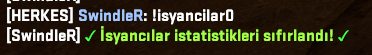

# 🔫 CS2 Plugin - [Isyancilar Plugin]

## Discord: https://discord.gg/YmaDNa8kjw

---

## 📌 Description

This plugin is a custom extension developed for Counter-Strike 2 servers. It offers the following features:

---

- ✅ This plugin works in Jailbreak modes.
- ✅ This plugin records the number of CT kills made by the T team and displays a TOP list.
- ✅ You can change the number of TOP entries if you wish. For example: Top5, Top20, etc.
- ✅ When installed on the server, it automatically creates a config file. You can customize various settings in this file, such as the ChatTag, prefix, permission flag, or the number of entries in the top list (e.g., top20).

---

## 🧩 Requirements

- Counter-Strike 2 (dedicated server)
- CounterStrikeSharp

---

## 🛠️ Installation

### 1) Download the Plugin

- Download the latest release from:  
 👉 [Releases](https://github.com/SwindleR-b/CS2-Rebellion-Sound/releases)

### 2) Install the Plugin

Place the plugin in the following directory:

_cs2/addons/counterstrikesharp/plugins/_

### 3) Start / Reload the Plugin

To activate:

- Restart your server  
  **OR**
- Run the following command in the server console:
css_plugins load Isyancilar

---

## ⚙️ Commands

|    Command     |                                                          Description                                                   |
|------------    |------------------------------------------------------------------------------------------------------------------------|
| `!isyancilar`  | Opens the TOP list.                                                                                                    |
| `!isyancilar0` | Players with the **@css/root** permission can use this feature. This permission can be changed in the config file.     |

---

## 📁 Configuration File
After restarting your server, a configuration file will be automatically generated at:

_cs2/addons/counterstrikesharp/config/plugins/SwindleR-isyancilar/SwindleR-isyancilar.json _

- You can make any desired adjustments to this configuration file and customize it to suit your needs.
- You can edit any messages and configure language settings through the lang file.

---

## 📸 Screenshots

Here are some in-game screenshots of the plugin in action:

                             
 TOP LIST 

  

                             TOP LIST RESET

  

                             STATS.JSON

  

---

